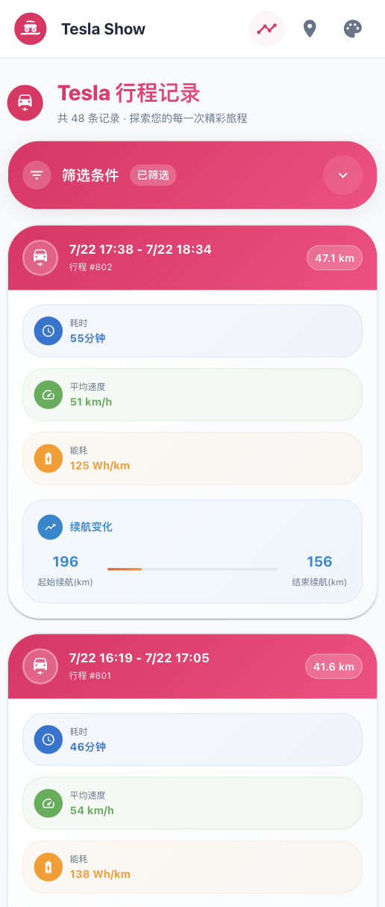
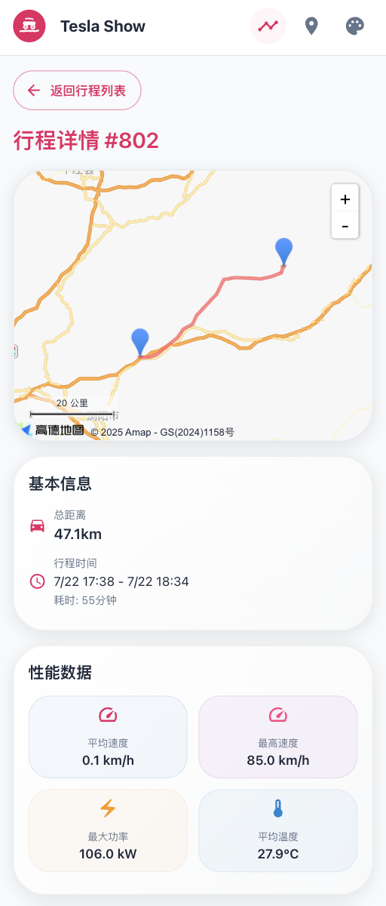
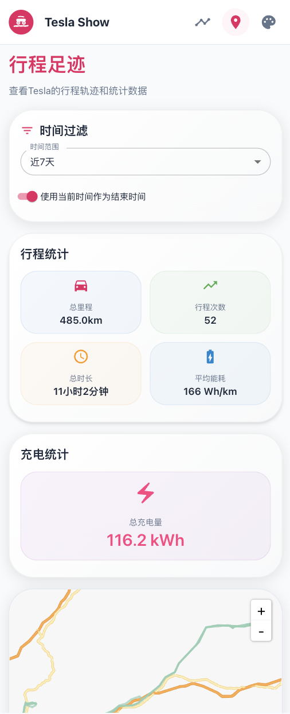
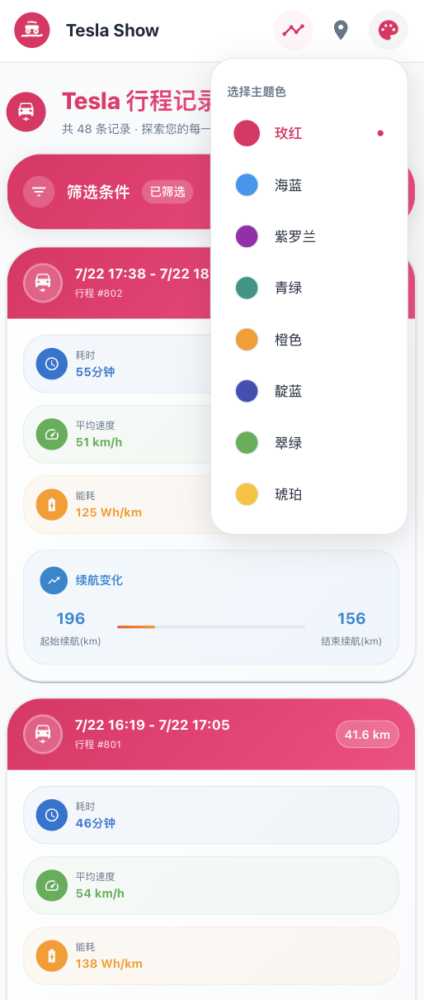

# TeslaShow

<div align="center">


**现代化的Tesla行程数据可视化系统**

[](https://opensource.org/licenses/MIT)
[](https://nextjs.org/)
[](https://www.typescriptlang.org/)
[](https://mui.com/)

[English](README_EN.md) | 中文

</div>

## 📖 项目简介

TeslaShow 是一个专为 TeslaMate 用户设计的现代化行程数据可视化系统。基于 Next.js 15 构建，提供直观美观的界面来展示您的 Tesla 行程数据、轨迹分析和统计信息。

### ✨ 主要特性

- 🚗 **行程管理** - 查看详细的历史行程列表和单次行程详情
- 🗺️ **轨迹可视化** - 基于高德地图的行程轨迹展示
- 📊 **数据统计** - 总里程、行驶时间、充电、能耗分析等统计信息
- 🎨 **现代化UI** - Material Design 3 风格，支持多主题色彩
- 📱 **响应式设计** - 完美适配桌面端和移动端
- ⚡ **高性能** - 基于 Next.js 15 App Router，优化的数据加载
- 🐳 **容器化部署** - 提供 Docker 支持，一键部署
- 🔒 **数据安全** - 直连 TeslaMate 数据库，数据不离开您的环境

## 🖼️ 界面预览

### 行程列表页面
- 展示所有历史行程的卡片式列表
- 显示距离、时长、能耗等关键信息
- 支持分页浏览和时间过滤



### 行程详情页面
- 高德地图展示完整行程轨迹
- 详细的行程数据卡片展示
- 实时数据点信息（速度、功率、电量等）



### 足迹分析页面
- 可自定义时间范围的轨迹聚合显示
- 统计数据概览（总里程、行驶次数、平均能耗等）
- 充电数据统计



### 主题色彩
- 支持多种主题色彩切换
- Material Design 3 风格设计



## 🛠️ 技术栈

- **前端框架**: Next.js 15 (App Router)
- **UI 组件库**: Material-UI v7
- **地图服务**: 高德地图 API
- **数据库**: PostgreSQL (TeslaMate)
- **样式框架**: Tailwind CSS
- **状态管理**: React Hooks
- **HTTP 客户端**: Axios
- **类型系统**: TypeScript
- **容器化**: Docker & Docker Compose

## 🚀 Docker Compose 一键部署

### 前置要求

- Docker 和 Docker Compose
- 高德地图 API 密钥

### 部署步骤

1. **创建项目目录和必要文件夹**

首先创建一个新的目录作为项目根目录，并创建必要的数据存储文件夹：

```bash
# 创建项目目录
mkdir teslashow-deploy
cd teslashow-deploy

# 创建必要的数据存储文件夹
mkdir -p teslamate-db teslamate-grafana-data import mosquitto-conf mosquitto-data

# 设置文件夹权限（可选，确保容器有写入权限）
chmod 755 teslamate-db teslamate-grafana-data import mosquitto-conf mosquitto-data
```

2. **创建 docker-compose.yml 文件**

在项目目录中创建 `docker-compose.yml` 文件：

```yaml
services:
  teslamate:
    image: teslamate/teslamate:latest
    restart: always
    environment:
      - ENCRYPTION_KEY=secretkey #replace with a secure key to encrypt your Tesla API tokens
      - DATABASE_USER=teslamate
      - DATABASE_PASS=password #insert your secure database password!
      - DATABASE_NAME=teslamate
      - DATABASE_HOST=database
      - MQTT_HOST=mosquitto
      - MQTT_IPV6=true
    ports:
      - 4000:4000
    volumes:
      - ./import:/opt/app/import
    cap_drop:
      - all

  database:
    image: postgres:17
    restart: always
    # ports:
      # - 5433:5432  # 宿主机端口:容器端口5433是为测试使用，在teslashow项目在docker中还是使用5432
    environment:
      - POSTGRES_USER=teslamate
      - POSTGRES_PASSWORD=password #insert your secure database password!
      - POSTGRES_DB=teslamate
    volumes:
      - ./teslamate-db:/var/lib/postgresql/data

  grafana:
    image: teslamate/grafana:latest
    restart: always
    environment:
      - DATABASE_USER=teslamate
      - DATABASE_PASS=password #insert your secure database password!
      - DATABASE_NAME=teslamate
      - DATABASE_HOST=database
    ports:
      - 3000:3000
    volumes:
      - ./teslamate-grafana-data:/var/lib/grafana

  mosquitto:
    image: eclipse-mosquitto:2
    restart: always
    command: mosquitto -c /mosquitto-no-auth.conf
    # ports:
    #   - 1883:1883
    volumes:
      - ./mosquitto-conf:/mosquitto/config
      - ./mosquitto-data:/mosquitto/data

  teslashow:
    # build: .  # Build from local Dockerfile
    image: shareven/teslashow:latest  # Or use pre-built image
    depends_on:
      - database
    ports:
      - "3001:3000"
    environment:
      - NODE_ENV=production
      - DB_HOST=database
      - DB_PORT=5432
      - DB_NAME=teslamate
      - DB_USER=teslamate
      - DB_PASSWORD=password	# Use the same password as database service
      
      # Amap API Configuration
      # Please apply for your API keys at Amap Open Platform (https://lbs.amap.com/)
      - NEXT_PUBLIC_AMAP_API_KEY=your_amap_api_key_here
      # Amap security key - Get it from application management in Amap Open Platform
      - NEXT_PUBLIC_AMAP_SECURITY_KEY=your_amap_security_key_here
```

3. **修改配置参数**
 
 在上述配置文件中，请修改以下关键参数：
 
 - **数据库密码**：将所有 `password` 替换为安全密码
 - **加密密钥**：将 `secretkey` 替换为安全的加密密钥
 - **高德地图API**：配置您的高德地图API密钥
 
 4. **启动所有服务**
```bash
docker-compose up -d
```

5. **访问服务**

部署完成后，您可以访问以下服务：

- **TeslaShow**: http://localhost:3001 - 行程数据可视化界面
- **TeslaMate**: http://localhost:4000 - Tesla数据记录管理
- **Grafana**: http://localhost:3000 - 数据分析仪表板

### 服务说明

该 Docker Compose 配置包含完整的 TeslaMate 生态系统：

- **teslamate**: Tesla 数据记录服务
- **database**: PostgreSQL 数据库
- **grafana**: 数据可视化仪表板
- **mosquitto**: MQTT 消息代理
- **teslashow**: 本项目的行程展示界面

### 数据持久化

配置文件已设置数据卷挂载，确保数据持久化：
- `./teslamate-db`: 数据库数据
- `./teslamate-grafana-data`: Grafana 配置数据
- `./import`: TeslaMate 导入数据目录

## ⚙️ 高德地图 API 配置

### 获取 API 密钥

1. 访问 [高德开放平台](https://lbs.amap.com/)
2. 注册并登录账号
3. 创建应用并获取 API Key
4. 在应用管理中获取安全密钥（Security Key）
5. 确保启用了以下服务：
   - Web服务API
   - Web端（JS API）

### 配置说明

| 环境变量 | 描述 | 必需 |
|---------|------|------|
| `NEXT_PUBLIC_AMAP_API_KEY` | 高德地图 API 密钥 | ✅ |
| `NEXT_PUBLIC_AMAP_SECURITY_KEY` | 高德地图安全密钥 | ✅ |

## 🤝 贡献指南

我们欢迎所有形式的贡献！请查看 [贡献指南](CONTRIBUTING.md) 了解详情。

### 开发流程

1. Fork 本仓库
2. 创建特性分支 (`git checkout -b feature/AmazingFeature`)
3. 提交更改 (`git commit -m 'Add some AmazingFeature'`)
4. 推送到分支 (`git push origin feature/AmazingFeature`)
5. 开启 Pull Request

## 📄 许可证

本项目采用 MIT 许可证 - 查看 [LICENSE](LICENSE) 文件了解详情。

## 🙏 致谢

- [TeslaMate](https://github.com/teslamate-org/teslamate) - 优秀的 Tesla 数据记录工具
- [Next.js](https://nextjs.org/) - 强大的 React 框架
- [Material-UI](https://mui.com/) - 美观的 React 组件库
- [高德地图](https://lbs.amap.com/) - 可靠的地图服务

## 📞 支持

如果您遇到问题或有建议，请：

- 查看 [常见问题](FAQ.md)
- 提交 [Issue](https://github.com/shareven/teslashow/issues)
- 参与 [讨论](https://github.com/shareven/teslashow/discussions)

---

<div align="center">

**如果这个项目对您有帮助，请给它一个 ⭐️**

Made with ❤️ by Tesla 车主们

</div>