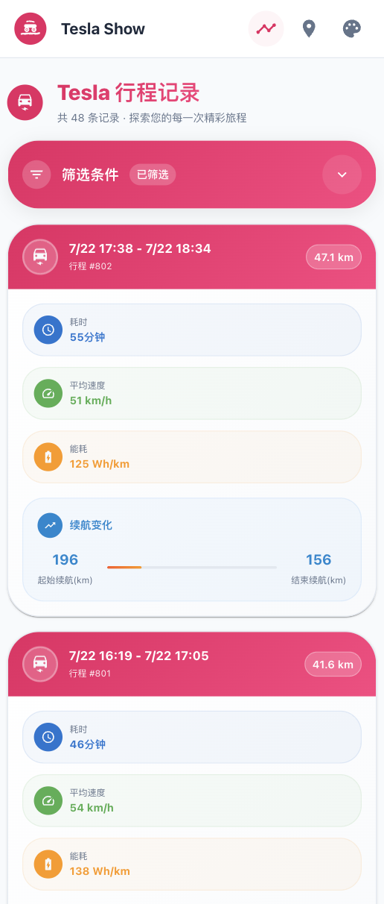
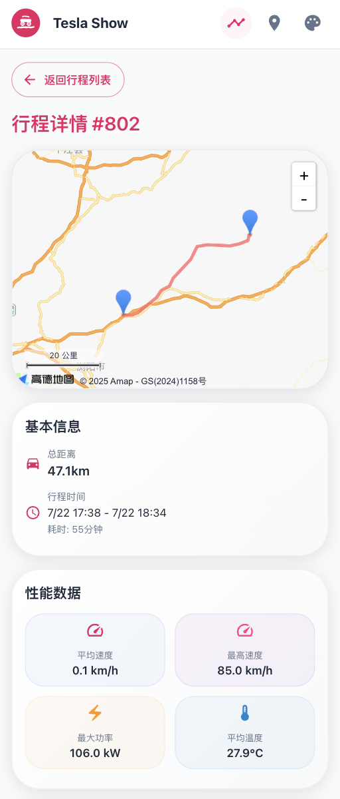
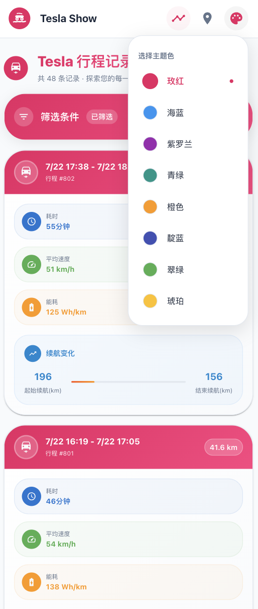

# TeslaShow

<div align="center">


**A Modern Tesla Trip Data Visualization System**

[](https://opensource.org/licenses/MIT)
[](https://nextjs.org/)
[](https://www.typescriptlang.org/)
[](https://mui.com/)

The new version v2.7 is now available!

English | [中文](README.md)

</div>

## 📖 Project Introduction

TeslaShow is a modern trip data visualization system designed specifically for TeslaMate users. Built with Next.js 15, it provides an intuitive and beautiful interface to display your Tesla trip data, trajectory analysis, and statistical information.

### ✨ Key Features

- 🚗 **Trip Management** - View detailed historical trip lists and individual trip details
- 🔋 **Charging Management** - View charging history records and detailed charging session information
- 🗺️ **Trajectory Visualization** - Trip trajectory display based on Amap
- 📊 **Data Statistics** - Total mileage, driving time, energy consumption analysis and other statistical information
- 🎨 **Modern UI** - Material Design 3 style with multiple theme color support
- 📱 **Responsive Design** - Perfect adaptation for desktop and mobile devices
- ⚡ **High Performance** - Based on Next.js 15 App Router with optimized data loading
- 🐳 **Containerized Deployment** - Docker support for one-click deployment
- 🔒 **Data Security** - Direct connection to TeslaMate database, data never leaves your environment

## 🖼️ Screenshots

### Trip List Page
- Card-style list displaying all historical trips
- Shows distance, duration, energy consumption and other key information
- Supports pagination and time filtering



### Trip Details Page
- Amap displays complete trip trajectory
- Detailed trip data cards
- Real-time data point information (speed, power, battery level, etc.)



### Charging List Page
- Card-style list displaying all historical charging records
- Shows charging time, energy added, charging power and other key information
- Supports pagination and time filtering


### Charging Details Page
- Detailed charging session data display (time, battery level changes, energy, power, etc.)
- Voltage, current, power, and SOC variation curves during charging process
- Charging location information


### Footprint Analysis Page
- Customizable time range trajectory aggregation display
- Statistical data overview (total mileage, trip count, average energy consumption, etc.)
- Charging data statistics


### Theme Colors
- Support for multiple theme color switching
- Material Design 3 style design



## 🛠️ Tech Stack

- **Frontend Framework**: Next.js 15 (App Router)
- **UI Component Library**: Material-UI v7
- **Map Service**: Amap API
- **Database**: PostgreSQL (TeslaMate)
- **Styling Framework**: Tailwind CSS
- **State Management**: React Hooks
- **HTTP Client**: Axios
- **Type System**: TypeScript
- **Containerization**: Docker & Docker Compose

## 🚀 Docker Compose One-Click Deployment

### Prerequisites

- Docker and Docker Compose
- Amap API keys

### Deployment Steps

1. **Create project directory and necessary folders**

First create a new directory as the project root directory, and create necessary data storage folders:

```bash
# Create project directory
mkdir teslashow-deploy
cd teslashow-deploy

# Create necessary data storage folders
mkdir -p teslamate-db teslamate-grafana-data import mosquitto-conf mosquitto-data

# Set folder permissions (optional, ensure containers have write permissions)
chmod 755 teslamate-db teslamate-grafana-data import mosquitto-conf mosquitto-data
```

2. **Create docker-compose.yml file**

Create a `docker-compose.yml` file in the project directory:

```yaml
services:
  teslamate:
    image: teslamate/teslamate:latest
    restart: always
    environment:
      - ENCRYPTION_KEY=secretkey #replace with a secure key to encrypt your Tesla API tokens
      - DATABASE_USER=teslamate
      - DATABASE_PASS=password #insert your secure database password!
      - DATABASE_NAME=teslamate
      - DATABASE_HOST=database
      - MQTT_HOST=mosquitto
    ports:
      - 4000:4000
    volumes:
      - ./import:/opt/app/import
    cap_drop:
      - all

  database:
    image: postgres:18-trixie
    restart: always
   #  ports:
      # - 5433:5432  # Host port:Container port 5433 is for testing, teslashow project in docker still uses 5432
    environment:
      - POSTGRES_USER=teslamate
      - POSTGRES_PASSWORD=password #insert your secure database password!
      - POSTGRES_DB=teslamate
    volumes:
      - ./teslamate-db:/var/lib/postgresql

  grafana:
    image: teslamate/grafana:latest
    restart: always
    environment:
      - DATABASE_USER=teslamate
      - DATABASE_PASS=password #insert your secure database password!
      - DATABASE_NAME=teslamate
      - DATABASE_HOST=database
    ports:
      - 3000:3000
    volumes:
      - ./teslamate-grafana-data:/var/lib/grafana

  mosquitto:
    image: eclipse-mosquitto:2
    restart: always
    command: mosquitto -c /mosquitto-no-auth.conf
    # ports:
    #   - 1883:1883
    volumes:
      - ./mosquitto-conf:/mosquitto/config
      - ./mosquitto-data:/mosquitto/data

  teslashow:
    # build: .  # Build from local Dockerfile
    image: shareven/teslashow:latest  # Or use pre-built image
    depends_on:
      - database
    ports:
      - "3001:3000"
    environment:
      - NODE_ENV=production
      - DB_HOST=database
      - DB_PORT=5432
      - DB_NAME=teslamate
      - DB_USER=teslamate
      - DB_PASSWORD=password	# Use the same password as database service
      - TESLASHOW_USER=username       # Use the username to login ui
      - TESLASHOW_PASSWORD=password 	# Use the password to login ui
      
      
      # Amap API Configuration
      # Please apply for your API keys at Amap Open Platform (https://lbs.amap.com/)
      - NEXT_PUBLIC_AMAP_API_KEY=your_amap_api_key_here
      # Amap security key - Get it from application management in Amap Open Platform
      - NEXT_PUBLIC_AMAP_SECURITY_KEY=your_amap_security_key_here
```

3. **Modify configuration parameters**
 
 In the above configuration file, please modify the following key parameters:
 
 - **Database password**: Replace all `password` with a secure password
 - **Encryption key**: Replace `secretkey` with a secure encryption key
 - **Amap API**: Configure your Amap API keys
 - **TESLASHOW_USER**: Configure your login username
 - **TESLASHOW_PASSWORD**: Configure your login password
 
 4. **Start all services**
```bash
docker-compose up -d
```

5. **Access services**

After deployment is complete, you can access the following services:

- **TeslaShow**: http://localhost:3001 - Trip data visualization interface
- **TeslaMate**: http://localhost:4000 - Tesla data recording management
- **Grafana**: http://localhost:3000 - Data analysis dashboard

### Service Description

This Docker Compose configuration includes the complete TeslaMate ecosystem:

- **teslamate**: Tesla data recording service
- **database**: PostgreSQL database
- **grafana**: Data visualization dashboard
- **mosquitto**: MQTT message broker
- **teslashow**: This project's trip display interface

### Data Persistence

The configuration file has set up data volume mounts to ensure data persistence:
- `./teslamate-db`: Database data
- `./teslamate-grafana-data`: Grafana configuration data
- `./import`: TeslaMate import data directory

## ⚙️ Amap API Configuration

### Getting API Keys

1. Visit [Amap Open Platform](https://lbs.amap.com/)
2. Register and login to your account
3. Create an application and get API Key
4. Get security key (Security Key) in application management
5. Ensure the following services are enabled:
   - Web Service API
   - Web (JS API)

### Configuration Description

| Environment Variable | Description | Required |
|---------------------|-------------|----------|
| `NEXT_PUBLIC_AMAP_API_KEY` | Amap API key | ✅ |
| `NEXT_PUBLIC_AMAP_SECURITY_KEY` | Amap security key | ✅ |

## Upgrading PostgreSQL to a new major version

Click [TeslaMate: upgrading PostgreSQL to a new major version](https://docs.teslamate.org/docs/maintenance/upgrading_postgres)

## 🤝 Contributing

We welcome all forms of contributions! Please check the [Contributing Guide](CONTRIBUTING.md) for details.

### Development Workflow

1. Fork this repository
2. Create a feature branch (`git checkout -b feature/AmazingFeature`)
3. Commit your changes (`git commit -m 'Add some AmazingFeature'`)
4. Push to the branch (`git push origin feature/AmazingFeature`)
5. Open a Pull Request

## 📄 License

This project is licensed under the MIT License - see the [LICENSE](LICENSE) file for details.

## 🙏 Acknowledgments

- [TeslaMate](https://github.com/teslamate-org/teslamate) - Excellent Tesla data logging tool
- [Next.js](https://nextjs.org/) - Powerful React framework
- [Material-UI](https://mui.com/) - Beautiful React component library
- [Amap](https://lbs.amap.com/) - Reliable map service

## 📞 Support

If you encounter issues or have suggestions:

- Check [FAQ](FAQ.md)
- Submit an [Issue](https://github.com/shareven/teslashow/issues)
- Join [Discussions](https://github.com/shareven/teslashow/discussions)

---

<div align="center">

**If this project helps you, please give it a ⭐️**

Made with ❤️ by Tesla Owners

</div>